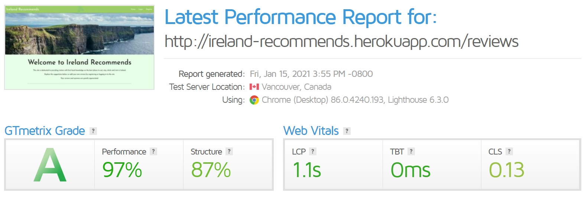

# Milestone 3 Project - Ireland Recommends

The purpose of this project is to develop an interactive website where users can create, read, update and delete reviews on places to eat, drink, stay and visit in Ireland. This website will allow users to both get and give recommendations and is designed to be responsive and accessible on desktop and mobile devices.

Elements of this website were developed from the Code Institute coursework as well recommendations from my mentor and independent online research and observations.

You can view the live website here: [Ireland Recommends](https://ireland-recommends.herokuapp.com/)


## Contents

- <a href="#ux">1. User Experience </a>
- <a href="#data">2. Data Architecture </a>
- <a href="#tech">3. Technologies Used </a>
- <a href="#test">4. Testing </a>
- <a href="#deploy">5. Deployment </a>
- <a href="#credit">6. Credits </a>

<span id="ux"></span>

## 1. User Experience

Ireland Recommends is a consumer to consumer website that allows users to filter and read other users reviews as well as create, edit and delete their own reviews of tourism focused establishments in Ireland.

### 1.1 User Stories
- As a read only or first time user:
    - I am able to easily navigate the Ireland Recommends website. 
    - I can view reviews posted by other users and filter or search for reviews from the homepage. 
    - I can also "like" reviews left by other users. 
    - Should I wish to leave a review I can easily register as a user of the site and login without diffciulty. 
    - From my profile page, I can add a review and see it posted.

- As a regular user:
    - I can log in to the Ireland Recommends site easily and view my posted reviews. 
    - I can edit or delete reviews that I have posted in the past as well as add new reviews.

- As an administrator of the site:
    - I can log in to the site as an admin user and view all reviews that have been posted by users. 
    - I can also edit or delete any review posted by users.

### 1.2 Strategy
 - The goal of this project is to create an interactive website where users can view reviews, upvote their popularity, add their own reviews and then edit or delete those reviews at any time. An administrator can edit or delete any reviews posted by users on the site. Ireland Recomments uses the Flask framework and is connected to a MongoDB database for the creation, reading, updating and deleting of information present on the site.

### 1.3 Scope 

#### Current Features

**Base HTML**
- The base template contains a Navbar that utilises an IF Statment which changes the links displayed depending on whether a user is logged in or out or if they are an administrator. The navbar is fixed to the top of the page when a user scrolls on each page. Using Materialize, the navbar is responsive on small screens and converts to an interactive burger icon. This icon triggers a menu that slides from the right hand side of the screen. It is easy to use and visually appealing.
- Flash messages are displayed using Flask's flash feauture. This feature displays messages to the user when they interract with the site.
- A footer is also contained in the base template. Social media icons are located in the footer. For the purpose of this project these icons are linked to the each social media sites homepage which opens in a seperate tab.

**Reviews Page**
- The reviews page is the main landing page of the Ireland Recommends site. It contains the base template content as well as a hero image and the following elements. 
- Filter icons are located below the hero image on the reviews page, these filters allow users to see reviews from the four categories associated with the filters.
- In order to improve a the sites usability and user experience, a search bar located below the filters allows users to search for keywords within the reviews and display the related reviews on the page.
- Each review is displayed on a card that is generated using a Jinja for loop. The card is tyled using Materialize and contains an image relating to the review, a short description of the review, the review date, a chit containing the review category and a "Like" upvote button. Using a Python sort function, cards are displayed with the newest review first.

**Individual Review Page**    
 - Each review card is linked to an indiviudal review page. This page contains a simple layout featuring a large image associated with the review, the review name, its long description and the details of the user that added or edited the review. When a user is logged in to the site, they have the ability to edit or their delete the review if they are the user who originally posted it. In addition, there is a 'return to home' button which acts as an additional navigation option for ease of use. 

**Login / Register Page**
- A simple card design for both logging in and registering with the site. Both pages contain a form to add in the desired username and password. The username and password must be 
  alphanumerical and be of a length between 5 and 15 characters.

**Profile Page**
- Instead of a flash message, users are welcomed by a message which includes their username over the background of an image 
    of Ireland.
- Reviews that the user has already added will appear on this page in the form of cards. These cards will also include the option for users to edit and delete their own reviews. 
- As part of defensive programming, the delete button is followed by a modal which asks the user if they are sure that they 
    want to delete the review.

**Add/Edit Review Page**
- Both of these pages have a similar design and allow users to add or edit informaion about their reviews. Each entry into the form uses the 
    required attribute except for the images URL field. Some have min and max values to ensure that the layout remains consistent. As well as text 
    entries, there is a date selection function to choose the date that the reviewip has been added. Extra JQuery has been added to ensure 
    that the category name is not left blank. This was taken from Code Institute coursework. Should a review be added without an image attached, a default image will be displayed.

**Manage All Pages**
- For the Admin user only, there is a Manage All button in the Navbar where the user is able to read, update and delete all reviews added by any user. 


#### Possible Features Left to Implement

- **Upvote Button** - At the moment, the upvote "Like" feature on the review cards will increment the number of upvotes by 1 every time a user clicks on the like button. In the future I would like to make this a click on / click off button. This would require the user id to be stored in the database if the button is clicked and removed if it is clicked again.
- **Commercialise Site** - In the future I would like to add the ability for businesses related to the review categories to advertise on the site and potentially generate revenue for the site owner.
- **Pagination** - Pagination could be added to the Reviews page as many users could add a large number of reviews to the site.

### 1.4 Structure
- The Ireland Recommends site is split into seperate pages for each function. For all users, different pages exist for the home, reviews, login and register page. For a logged in user, the Profile and Edit Review page exists, and the Manage All page exists for the administrator. Each page has the same footer and the responsive Navbar to ensure a consistent user experience across the site.

### 1.5 Skeleton
A mobile first approach was taken to designing the website. The original wireframes were created using Balsamiq and can be found below:

- Mobile Wireframe PDF - <a href="https://drive.google.com/file/d/1mZFBJaE9AHte7Ps6IZO7y6owGuUefVHX/view?usp=sharing" rel="noopener" target="_blank">mobile version in PNG</a>.
- Desktop Wireframe PDF - <a href="https://drive.google.com/file/d/1pcw1GKw0YcSmr4G45tPgPNvmSDhIfQSt/view?usp=sharing" rel="noopener" target="_blank">desktop version in PNG</a>.

The wireframe mockups gave me a basic idea of how best to lay out each individual element that I wanted to incorporate into the project and how that would impact and enhance the user experience. As the project progressed, how best to place each of these elements became apparent.

### 1.6 Surface

#### Design
* Colour scheme
    - In keeping with the Irish theme of the site, I decidedto use a green and white colour scheme throughout the site. The type of colour is from the Materialize Light Green Colour Palette which has been lightened to improve visual appearance. Warning flash messages appear in red on the site and welcome and departure messages appear in black. The hover css attribute changes the colour of the category and social media icons when the user hovers over them.

* Logo
    - The logo used for the Ireland Recommends website is a Triskell Celtic Symbol, a free to use image from PlumePloume and Pixabay, available **[here](https://pixabay.com/vectors/triskell-symbol-celtic-logo-1194004/)**

* Font
    - I selected the Josefin font from Google Fonts for this project as it is reminiscent of classic minimalist travel posters and fits in with the styling of the website. This font is backed up by the sans-serif font.

* Images
    - The hero images and background images were all taken from [Pexels](https://www.pexels.com/). The images for the individual reviews 
    are added via a URL link by the user. 

#### Defensive Design
- The following defensive programming design elements are in place to prevent a negative user experince:
    - In order to ensure that users and administrators do not accidentally delete a review permanently, a pop up modal requires the user to confirm their decision.
        
    - Usernames and passwords have a minimum and maximum (5,15) number of characters and can only be alphanumeric
    - Flash messaging is used to prevent users from accessing areas of the site that they do not have authorisation for. The page will then offer to return the user to the homepage.
        
    - If no reviews are available to display, again flash messaging will inform the user of this.
        
    - If a user encounters a 403, 404 or 500 error, a custom error page will appear, again offering to return users to the homepage.
        

***

<span id="data"></span>

## 2. Data Architecture 

MongoDB Atlas is used for storing data for this website. The project ahas 3 collections in the MongoDB database.

A diagram of the current schema is available below:

<p></p>


***
<span id="tech"></span>

## 3. Technologies Used

### 3.1 Languages 

I used the following languages for the project:
- **[HTML/HTML5](https://en.wikipedia.org/wiki/HTML5)**
  - The project used **HTML/HTML5** as this is the essential language of websites.

- **[CSS/CSS3](https://en.wikipedia.org/wiki/Cascading_Style_Sheets)** 
  - The project used **CSS/CSS3** to provide the styles for the website.

- **[Javascript](https://en.wikipedia.org/wiki/JavaScript)** 
  - The project used **Javacsript** to provide the functionality and customisation for the modal, mobile nav bar and forms.

- **[Python](https://en.wikipedia.org/wiki/Python_(programming_language))**
  - The project used **Python** to provide backend functionality for the project.

### 3.2 Frameworks, Libraries and Programs
- **[MongoDB](https://www.mongodb.com/1)**
    - MongoDB was used to host the data used on the site and was chosen due to the non-relational nature of the data.
- **[Flask](https://flask.palletsprojects.com/en/1.1.x/)**
    - The Flask framework was used to import the Flask, flash, render_template, redirect, request, session, and url_for 
    functions that are used throughout the site.
- **[BSon](http://bsonspec.org/)**
    - This was imported in order to access the data used across the site.
- **[Werkzeug](https://werkzeug.palletsprojects.com/en/1.0.x/)**
    - This was imported to include the password control and to enhance security on the site.
- **[Jinja Templating](https://jinja.palletsprojects.com/en/2.11.x/templates/)**
    - This was used predominantly for the for loops and if statements in order to display all of the relevant data.
- **[JQuery](https://jquery.com/)**
    - I have used JQuery predominantly to initialise the components used in the Materialize framework. In addition, I used 
    code taken from the Code Institute's Data Centric Development Module to ensure that the category names in the add and edit review forms are 
    a required attribute.
- **[Materialize 1.0.0](https://materializecss.com/)**
    - Materialize was used to assist with the responsiveness and styling of the website, such as the navbars for desktop and 
    mobile, buttons, forms, cards and colours.
- **[Google Fonts](https://fonts.google.com/)**
    - Google fonts were used to import the 'Josefin' font which is used on all pages throughout the project.
- **[Font Awesome](https://fontawesome.com/)**
    - Font Awesome was used on all pages throughout the website to add icons for aesthetic and UX purposes. 
- **[Balsamiq](https://balsamiq.com/)**
    - Balsamiq was used to create the wireframes during the design process.


### 3.3 IDE

- **[GitPod](https://www.gitpod.io/)**
    - Gitpod was used to develop the website and style each element before deployment.

### 3.4 External Hosting

- **[GitHub](https://github.com/)**
    - This project uses the GitHub hosting service and is saved in a GitHub repository.

- **[Heroku](https://dashboard.heroku.com/apps)**
    - Heroku is used for the hosting of the site and is deployed through here.

- **[Google Drive](ttps://drive.google.com/)**
    - The Testing Document and Wireframe PNG files are saved to a Google Drive account and are openly accessible.
***
<span id="test"></span>

## 4. Testing

### 4.1 Validation 

[Please follow this link to view the full testing document]()

The following  tools validate every page of the project to ensure it did not contain syntax errors.

- **[W3C HTML Validator](https://validator.w3.org/)**
    - The W3C HTML Validator checked the website for HTML validity errors.
    - This same result appears across every page of the site.
    <p>   </p> 

- **[W3C CSS Validator](https://jigsaw.w3.org/css-validator/)**
    - The CSS Validator checked for validity errors in the website's CSS page.
    - There is 1 property issue found when checking the site. However, these are being validated from the Materialize 
    link and therefore out of my control.
    <p>   </p>

- **[JSHint](https://jshint.com/)** 
    - No issues were found on this check.
    <p> </p>

- **[Python Validator](http://pep8online.com/)**
    No issues were found on this check.
    <p> </p>  

- **[Autoprefixer CSS Online](https://autoprefixer.github.io/)**
    - The Autoprefixer ensured that vendor prefixes were added to my CSS.

- **[Chrome DevTools](https://developers.google.com/web/tools/chrome-devtools)**
    - Google Chrome's DevTools were used to inspect elements of the website and adjust them to ensure that they were effective and responsive at different screen sizes. DevTools was also used to identify errors in my code and to test how changing certain elements would effect the overall look and feel of the website.

### 4.2 Autoprefixer CSS Online

This was used to parse CSS and add vendor prefixes in order to ensure that the CSS styling works properly across all 
browsers. I have added the below header to my CSS styles sheet in order to show this.

### 4.4 Testing User Stories

[Please follow this link to view the full testing document]()


### 4.5 Device Testing

#### Lighthouse

<p >Desktop
Mobile</p>

From Chrome Developer Tools, this Lighthouse score is based on the performance of the Ireland Recommends homepage while being viewed on desktop and mobile. The 
performace score varied significantly while testing, mianly due to the image link added by users 
to the site for each individual review.

#### On screen sizes of tablet size and below: 
- Cards and divs are responsive and will align with the mobile view. 

### Further Testing

- **[Balsamiq](https://balsamiq.com/)**
    - I used Balsamiq to design the original wireframes for the project and test how the layout looked. I reverted to Balsamiq when considering changes in the project's design.

- **[GTMetrix](https://gtmetrix.com/)**
    - GTMetrix was used to test the loading speed of the site and to find out if any elements were creating long loading times. Ireland Recommends received an A grande for performance and structure.
    

### 4.6 Bugs
I encountered the following bugs while developing the Ireland Recommends website:
- When users were submitting a review, they could select any date using a date picker from Materialize. In order to acurately record the date, my mentor recommended that this should be automated using Python. It took some time to find the correct format but I eventually got the code to record dates accurately.
- 

<span id="deploy"></span>

## 5. Deployment

### Requirements 
- Python3 
- Github account 
- MongoDB account 
- Heroku account

### Clone Ireland Recommends from GitHub
To make a local clone and deploy this project in your GitHub Desktop, follow these steps. 
1. Log in to GitHub and go to the repository. 
2. Click on the green button with the text **“Code”.**
3. Click on **“Open with GitHub Desktop”** and follow the prompts in the GitHub Desktop Application or follow the instructions from **[this link](https://docs.github.com/en/free-pro-team@latest/github/creating-cloning-and-archiving-repositories/cloning-a-repository#cloning-a-repository-to-github-desktop)** to see how to clone the repository in other ways. 

### Working with the local copy
1. Install all the requirements: Go to the workspace of your local copy. In the terminal window of your IDE type: **pip3 install -r requirements.txt**.
2. Create a database in MongoDB  
    - Signup or login to your MongoDB account.
    - Create a cluster and a database.
    - Create three collections in the db: **categories, reviews and users.**
    - Add string values for the collections. See <a href="#data">my data architecture</a> above for an exapmple of how the database is set up for this project.
3. Create the environment variables 
    - Create a .gitignore file in the root directory of the project.
    - Add the env.py file in the .gitignore.
    - Create the file env.py. This  will contain all the environment variables.
    ```
    Import os
    os.environ.setdefault("IP", "0.0.0.0")
    os.environ.setdefault("PORT", "5000")
    os.environ.setdefault("SECRET_KEY", "YOUR_SECRET_KEY")
    os.environ.setdefault("MONGO_URI", "YOUR_MONGODB_URI")
    os.environ.setdefault("MONGO_DBNAME", "YOUR_DATABASE_NAME")
    ```
4. Run the app: Open your terminal window in your IDE. Type python3 app.py and run the app.

#### Heroku Deployment  
1. Set up local workspace for Heroku 
    - In terminal window of your IDE type: **pip3 freeze -- local > requirements.txt.** (The file is needed for Heroku to know which filed to install)
    - In termial window of your IDE type: **echo web: python run.py > Procfile** (Heroku needs this file to launch the app)
2. Set up Heroku: create a Heroku account, create a new app and select your region. 
3. Deployment method will be 'Github'
    - Click on the **Connect to GitHub** section in the deploy tab in Heroku. 
        - Search your repository to connect with it.
        - When your repository appears click on **connect** to connect your repository with the Heroku. 
    - Go to the settings app in Heroku and go to **Config Vars**. Click on **Reveal Config Vars**.
        - Enter the variables contained in your env.py file. it is about: **IP, PORT, SECRET_KEY, MONGO_URI, MONGO_DBNAME**
4. Push the requirements.txt and Procfile to repository. 
     ```
    $ git add requirements.txt
    $ git commit -m "Add requirements.txt"

    $ git add Procfile 
    $ git commit -m "Add Procfile"
    ```
5. Automatic deployment: Go to the deploy tab in Heroku and scroll down to **Automatic Deployments**. Click on **Enable Automatic Deploys**. By **Manual Deploy** click on **Deploy Branch**.

Heroku will receive the code from Github and host the app using the required packages. 
Click on **Open app** in the right corner of your Heroku account. The app wil open and the live link is available from the address bar. 

***
<span id="credit"></span>

## 6. Credits

### 6.1 Content
The design and style of my project was initially inspired by elements of the following project:
- [adamdelancey's Milestone 3 Project, Tips](https://github.com/adamdelancey/ms3-tips)

Some README content and layout was also inspired by the following project:
- [juanstelling's Milestone 3 Project, Breaktasty](https://github.com/juanstelling/MS3_breaktasty/blob/master/README.md)

The following sources were used for code snippets or inspiration throughout the project:

- Initial instructions for setting up the site were taken from the Task Manager walkthrough from the [Code Institute](https://codeinstitute.net/) Full Stack Developer Course.
- The Navbar, Forms and Cards have been selected from [Materialize](https://materializecss.com/) templates and adapted using CSS.
- Code for replacing images with a default generic image was inspired by the following post on [CodeSpeedy](https://www.codespeedy.com/set-default-image-if-image-url-is-broken-in-javascript/)
- Code for creating the upvote "Like" python function was advised by ShaneMuir_Alumni in the Code Institute Slack Community as well as [this thread](https://stackoverflow.com/questions/12147686/storing-upvotes-downvotes-in-mongodb) on Stack Overflow
- Integration of category filtering and the search function into the Reviews python application was advised by my mentor, Oluwafemi Medale
- Code for automatically generating the Review posting date was inspired by the following from [Programiz](https://www.programiz.com/python-programming/datetime/current-datetime)

### 6.2 Media

**Images**
- The Ireland Recommends Logo was sourced from PlumePloume on Pixabay, available [here](https://pixabay.com/vectors/triskell-symbol-celtic-logo-1194004/)
- The following images were sourced from free to use content on Pixabay: 
    - [CLiffs of Moher](https://pixabay.com/?utm_source=link-attribution&amp;utm_medium=referral&amp;utm_campaign=image&amp;utm_content=2371819)
    - [Kylemore Abbey](https://pixabay.com/?utm_source=link-attribution&amp;utm_medium=referral&amp;utm_campaign=image&amp;utm_content=2408435)
    - [The Skelligs](https://pixabay.com/?utm_source=link-attribution&amp;utm_medium=referral&amp;utm_campaign=image&amp;utm_content=3640168)
 
 
**Fonts and Icons**
- Fonts are from [Google Fonts](https://fonts.google.com/) and icons from [Font Awesome](https://fontawesome.com/)

**Mockups**
- Mockups were generated using [ami.responsivedesign.is](ami.responsivedesign.is)
    

### 6.3 Acknowledgements
- **Oluwafemi Medale** (My Mentor) - Thank you for your assistance with this project.
- **The Code Institute Slack Community** - The community was a great source of inspiration and assistance throughout the project.
- **My family** for their assistance testing the website and adding reviews.


***

